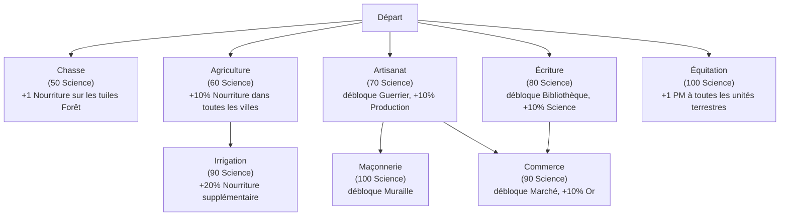

# Early Civilization

*Par Théo COURTADE*

# Développement d'une application de jeu **Civilization** (version minimaliste) en solo

[[_TOC_]]

---

## Objectif du projet

Ce projet a pour but de mettre en œuvre vos compétences en développement C, en implémentation de structures de données, en développement d'une intelligence artificielle simple et en gestion de projet. Il s'agit d'un défi à la fois ludique et pratique, centré sur la conception d'un jeu de stratégie.

L'objectif est de concevoir et développer une application permettant de jouer à une version minimaliste et solo du célèbre jeu de stratégie au tour par tour **Civilization**. Le joueur contrôle une civilisation sur une carte, gère des ressources, fonde des villes, recherche des technologies et tente d'atteindre une condition de victoire avant que le temps (nombre de tours) ne soit écoulé.

Les élèves devront réaliser une application complète en langage C, comprenant :
- Une **version CLI/ASCII graphics** (affichage dans le terminal, interactions au clavier)
- Une **version graphique** utilisant la bibliothèque [libSDL](https://www.libsdl.org/)

---

## Objectifs Pédagogiques

- Élaborer un cahier des charges et une fiche de projet
- Modéliser un jeu de stratégie complexe à partir d'une spécification
- Implémenter des structures de données avancées en langage C (tableaux 2D, listes chaînées, arbres de recherche, graphes)
- Développer et appliquer des tests unitaires pour assurer la qualité et la fiabilité du code
- Acquérir une expérience concrète de la gestion de projet en équipe (planification, suivi d'avancement, comptes rendus de réunion)
- Mettre en pratique la gestion de versions (utilisation de Git/GitLab)

---

## Cahier des charges

> [!NOTE]
> **Note générale :**
> 
> De nombreux chiffres et bonus présentés dans ce document (coûts, revenus, seuils, etc.) sont fournis **à titre d’exemple** pour clarifier la mécanique. Il est parfaitement acceptable, lors de l’implémentation, de choisir des valeurs différentes tant qu’elles respectent l’esprit des règles et restent cohérentes entre elles. Ces constantes devront être explicitement documentées dans la spécification technique ou rendues paramétrables.

### Fonctionnalités obligatoires (cœur du jeu)

- **Mode textuel** : Une version jouable intégralement dans le terminal, avec affichage de la carte en caractères ASCII et saisie au clavier.
- **Mode graphique** : Une version avec interface SDL affichant la carte en tuiles colorées ou texturées, les unités, les villes et les informations de la civilisation. Interaction à la souris optionnelle.
- **Jeu solo, tour par tour** : Un seul joueur humain contrôle une civilisation. L'adversité est assurée par les conditions du jeu (ressources limitées, temps, Barbares).
- **Gestion de la carte** : Génération d'une carte 2D sous forme de grille rectangulaire avec différents types de terrain.(voir [§2 : La Carte](#2-la-carte))
- **Gestion des ressources** : Le joueur gère plusieurs ressources (Nourriture, Production, Science, Or) (voir [§3 : Les Ressources](#3-les-ressources)).
- **Villes** : Le joueur peut fonder des villes, les faire grandir et y produire des unités ou des bâtiments (voir [§4 : Les Villes](#4-les-villes)).
- **Unités** : Deux types d'unités (Colon et Guerrier), le Guerrier étant débloqué par une technologie (voir [§5 : Les Unités](#5-les-unit%C3%A9s)).
- **Arbre de technologies** : Un graphe de technologies déblocables par accumulation de Science (voir [§6 : L'Arbre Technologique](#6-larbre-technologique)).
- **Barbares** : Des unités ennemies autonomes peuplent la carte et constituent la principale menace pour la civilisation du joueur (voir [§8 : Les Barbares](#8-les-barbares)).
- **Conditions de victoire et de défaite** : Le joueur gagne ou perd selon des critères définis (voir [§7 : Conditions de Victoire et de Défaite](#7-conditions-de-victoire-et-de-d%C3%A9faite)).

---

### Fonctionnalités optionnelles

- Il vous est demandé de réaliser au moins **1** des fonctionnalités supplémentaires (appelées Extensions) proposées à [la fin de ce document](#extensions).

### Technologies

- **C** : Utilisation exclusive du langage C pour la programmation du jeu.
- **libSDL** : Utilisation de la bibliothèque C libSDL pour la réalisation de la version graphique.
- **Makefile** : La compilation doit être gérée par un Makefile propre avec des cibles séparées.
- (optionnel) **ncurses** : La librairie ncurses peut grandement simplifier l'implémentation de la version CLI.

### Cibles Makefile

Votre `Makefile` doit contenir au moins les cibles suivantes :

| Cible         | Description                                                                 |
|---------------|-----------------------------------------------------------------------------|
| `make req`    | Télécharge et installe les dépendances de votre projet                      |
| `make`        | Compile tout votre projet                                                   |
| `make cli`    | Lance la version CLI de votre projet *                                      |
| `make sdl`    | Lance la version SDL de votre projet *                                      |
| `make test`   | Lance vos tests unitaires                                                   |
| `make clean`  | Nettoie les fichiers de compilation et les exécutables, mais conserve les données |
| `make reset`  | Nettoie tous les fichiers de données (sauvegarde, configuration, scores, etc.) |

> (*) Ces commandes utilisent les options par défaut. Pour utiliser des options spécifiques, l'exécutable doit pouvoir être lancé directement.

### Paramètres de lancement

Le programme doit accepter des paramètres en ligne de commande. Les deux modes (CLI et SDL) partagent les mêmes paramètres optionnels :

> [!WARNING]
> Si un paramètre invalide est fourni, le programme affiche un message d’aide (`--help`) et se termine proprement. Assurez-vous que votre parser traite toutes les options listées ci-dessous.


> Pour unifier les projets, l'exécutable doit s'appeler `civ` !

| Paramètre long | Forme courte | Valeur par défaut | Description                          |
|----------------|:------------:|:-----------------:|--------------------------------------|
| `--width W`    | `-W W`       | 50                | Largeur de la carte en tuiles        |
| `--height H`   | `-H H`       | 30                | Hauteur de la carte en tuiles        |
| `--seed N`     | `-s N`       | aléatoire         | Graine de génération de la carte     |
| `--turns N`    | `-t N`       | 200               | Nombre de tours maximum              |
| `--barbarians N`| `-b N`      | 3                 | Nombre de campements barbares initiaux |
| `--mode MODE`  | `-m MODE`    | `cli`             | Mode d'affichage : `cli` ou `sdl`    |

Exemples d’utilisation :

```bash
./civ --mode sdl --width 40 --height 25 --seed 12345
./civ -m cli -t 150 -b 5
```

### Clarifications d'implémentation attendues

- La version CLI et la version SDL doivent partager le **même moteur de jeu** et les **mêmes règles**.
- Les valeurs numériques de ce sujet peuvent être adaptées, mais l’**ordre des phases**, les **mécaniques principales** et les **conditions de victoire/défaite** doivent rester reconnaissables.
- Toute simplification importante (par exemple combat, génération de carte, comportement des Barbares) doit être explicitement documentée dans la spécification technique.
- Le programme doit afficher ou journaliser en début de partie la **graine** effectivement utilisée.

---

## Points d'évaluation

- Qualité de la **modélisation** et des **structures de données** (représentation de la carte, des entités, de l’arbre technologique).
- Implémentation correcte de la **logique du jeu** et respect des règles décrites dans ce sujet.
- **Facilité d'utilisation** en mode texte **et** en mode graphique.
- Qualité et pertinence des **extensions** réalisées (au minimum **1**).
- Respect des **bonnes pratiques de programmation** (compilation séparée, Makefile, commentaires, organisation des fichiers source).
- **Architecture du code** : organisation en modules indépendants (carte, ville, unité, technologie, interface), séparation **stricte** entre la logique de jeu et l’affichage.
- **Tests unitaires** et robustesse (gestion des cas limites et des erreurs d’entrée).
- **Gestion de projet** : fiche de projet, comptes rendus de réunion, planification et répartition des tâches, utilisation correcte de Git.
- **Qualité de la démonstration** : capacité à lancer rapidement une partie, expliquer une situation de jeu et montrer les choix d’architecture.

---

## Rendu Final

Le rendu final devra comporter au minimum les éléments suivants, déposés sur le dépôt GitLab du projet :

- **Code source** : code source complet et Makefile fonctionnel, avec instructions d'installation, d’exécution et présentation du logiciel dans un fichier `README.md`.
- **Spécification technique** : description des structures de données (`struct`) choisies, de l’architecture des modules, des algorithmes implémentés, des justifications des choix de conception et du choix des extensions réalisées.
- **État de l’art** : rapport sur les algorithmes de génération de carte procédurale étudiés ou implémentés.
- **Tests unitaires** : jeu de tests unitaires accompagnant le code source, exécutables via `make test`.
- **Documents de gestion de projet** : comptes rendus de réunion, planification, répartition des tâches, analyse post-mortem.
- **Limites connues** : bugs résiduels, fonctionnalités partielles, simplifications assumées.

---

## Règles du jeu

Les règles définies ci-après constituent la **version de base obligatoire**. Les extensions sont décrites dans la section suivante.

---

### 0. Vue d'ensemble

Le joueur incarne une civilisation naissante sur une carte générée aléatoirement. À chaque tour, il déplace ses unités, gère ses villes et dépense ses ressources. L’objectif est d’atteindre une **condition de victoire** avant la fin du nombre de tours maximum ou avant de remplir une **condition de défaite**.

---

### 1. Séquence d'un Tour

Chaque tour se déroule dans l’ordre suivant :

1. **Phase d’action** : le joueur déplace ses unités et donne des ordres à ses villes (choix de projet) et choisit sa prochaine technologie.
2. **Phase de production** : calcul des revenus de ressources, avancement des projets de construction et de recherche.
3. **Phase de croissance** : mise à jour de la population de chaque ville (croissance ou famine).
4. **Phase des Barbares** : les unités barbares se déplacent et attaquent.
5. **Fin de tour** : vérification des conditions de victoire/défaite, passage au tour suivant.

---

### 2. La Carte

#### 2.1 Structure

La carte est une grille rectangulaire de **W × H tuiles** (valeurs par défaut : 50 × 30, configurables au lancement du jeu). Chaque tuile possède :
- Un **type de terrain** (voir tableau ci-dessous)
- Au plus **une unité** occupant la tuile
- Au plus **une ville** ou **un campement** fondée sur la tuile

> Dans la version de base, toutes les tuiles sont visibles dès le début de la partie. Le brouillard de guerre est une extension (voir [EXT-6 : Brouillard de guerre](#ext-6--brouillard-de-guerre)).

#### 2.2 Types de terrain

Ces valeurs sont données à titre d'exemple ; vous pouvez en ajouter d'autres ou modifier les bonus selon vos choix, en conservant l’équilibre du jeu.

| Terrain       | Bonus Nourriture | Bonus Production | Bonus Or | Bonus Science | Coût en PM |
|---------------|:----------------:|:----------------:|:--------:|:-------------:|:----------:|
| Plaine        | +2               | +1               | 0        | 0             | 1          |
| Forêt         | +1               | +2               | 0        | 0             | 2          |
| Montagne      | 0                | +3               | 0        | +1            | 3          |
| Eau           | +1               | 0                | +1       | 0             | Infranchissable |
| Désert        | 0                | 0                | +1       | 0             | 1          |
| Toundra       | +1               | +1               | 0        | 0             | 1          |

> Les cases Eau sont infranchissables pour les unités terrestres sans la technologie adéquate (voir [EXT-1 : Bateaux](#ext-1--bateaux)).

#### 2.3 Génération de la carte

> [!TIP]
> La graine de génération permet de déboguer et de reproduire des scénarios précis. Pensez à loguer la graine utilisée en début de partie pour faciliter la reproduction des bugs.

- La carte est générée **aléatoirement** au début de chaque partie à partir d’une graine (*seed*) entière.
- La graine peut être fixée par l’utilisateur pour rejouer la même carte.
- La distribution des terrains doit former des **zones** suffisamment grandes.
- Le joueur commence avec une **ville de départ** révélée et un **Guerrier** placé dessus. La ville de départ est toujours placée sur une Plaine.
- Les paramètres initiaux de la ville de départ doivent être explicités dans la documentation si vous les faites différer des villes fondées en cours de partie.

---

### 3. Les Ressources

Le joueur gère quatre ressources principales, accumulées à chaque tour.

| Ressource   | Utilité principale                                   |
|-------------|-----------------------------------------------------|
| Nourriture  | Fait croître la population des villes               |
| Production  | Fabrique des unités et des projets                  |
| Science     | Débloque des technologies                          |
| Or          | Entretien des unités et des bâtiments |

#### 3.1 Revenus de ressources

À chaque tour, chaque ville exploite les tuiles situées dans son **rayon d’exploitation** (voir [§4.2 : Rayon d'exploitation](#42-rayon-dexploitation)). Les bonus de terrain de ces tuiles sont répartis comme suit :

- **Nourriture** et **Production** : stockées séparément dans la réserve de la ville qui exploite la tuile (voir [§4.3 : Croissance de la population](#43-croissance-de-la-population) et [§4.4 : Production dans les villes](#44-production-dans-les-villes)).
- **Science** : ajoutée à la **cagnotte de recherche globale**.
- **Or** : ajouté au **trésor global** du joueur.

En complément du revenu de terrain, les bâtiments de chaque ville apportent leurs bonus à leur propre ville ou globalement selon leur type.

Les dépenses en Or sont déduites globalement à chaque tour :

```
Dépenses_Or = Σ(coût_entretien_unités) + Σ(coût_entretien_bâtiments)
```

> [!WARNING]
> - Si l’Or descend en dessous de 0, l’application doit afficher un avertissement et **dissoudre aléatoirement une unité** (faute de paiement). Si le joueur n’a plus d’unité à dissoudre, la production de toutes ses villes est réduite de moitié, arrondi à l’inférieur (grève ouvrière). Si la production totale tombe à 0 pendant 5 tours consécutifs, c’est une **défaite immédiate**.


---

### 4. Les Villes

#### 4.1 Fondation et Points de Vie

- Le joueur fonde une ville en utilisant l’action **Coloniser** d’un Colon sur une tuile libre (ni eau, ni déjà occupée par une ville ou un campement).
- L’unité Colon est **détruite** lors de la fondation.
- La ville nouvellement fondée a une population de **1** et une réserve de nourriture à **0**.
- Deux villes ne peuvent pas être fondées à moins de **4 tuiles** l’une de l’autre (distance de Tchebychev).
- **Points de Vie (PV) d’une ville** : Les PV d’une ville sont égaux à `10 × population`. Toute perte de population réduit immédiatement les PV max et courants si besoin. Les PV sont restaurés de moitié à chaque tour où la ville n'a pas subi de dégâts.
- Certaines technologies ou bâtiments peuvent modifier ce calcul (voir [§4.5 : Bâtiments disponibles](#45-b%C3%A2timents-disponibles-version-de-base) pour la Muraille).

#### 4.2 Rayon d'exploitation

Chaque ville exploite les tuiles situées dans un rayon dépendant de sa **population**, plafonné à **3 tuiles** (distance de Tchebychev) :

| Population | Rayon d'exploitation |
|:----------:|:--------------------:|
| 1–9        | 1                    |
| 10–25      | 2                    |
| 26+        | 3                    |

**Règle de conflit :**
> [!WARNING]
> Une tuile dans le rayon de plusieurs villes n’est exploitée qu’**une seule fois**. Elle est attribuée à la ville dont la distance de Tchebychev est minimale. En cas d’égalité (par exemple trois villes à même distance), la tuile revient à la **ville la plus ancienne** (fondée en premier).


#### 4.3 Croissance de la population

- Chaque tour, la ville reçoit en Nourriture nette : les bonus de Nourriture de ses tuiles exploitées + les bonus de ses bâtiments − sa consommation.
- La consommation de base d’une ville de population **N** est de **2 × N** points de Nourriture par tour.
- Quand la réserve de Nourriture atteint un **seuil de croissance** (défaut : `20 + 10 × population_actuelle`), la population augmente de 1 et la réserve est remise à 0.
- Si la réserve de Nourriture descend en dessous de 0, la ville **perd 1 point de population** (famine). Si la population atteint 0, la ville est dissoute.

#### 4.4 Production dans les villes

- Chaque tour, les points de Production de la ville (bonus de Production des tuiles exploitées + bonus des bâtiments) alimentent un **projet en cours** (unité ou bâtiment).
- Un seul projet peut être en construction à la fois par ville.
- Quand la cagnotte de Production du projet atteint son **coût total**, l’unité est créée ou le bâtiment est construit.
- S’il n’y a pas de projet, les points de Production sont perdus.

#### 4.5 Bâtiments disponibles (version de base)

Comme pour les terrains, ces bâtiments sont donnés à titre d'exemple.

| Bâtiment         | Coût (Production) | Entretien (Or/tour) | Effet                                   | Prérequis   |
|------------------|:-----------------:|:-------------------:|-----------------------------------------|-------------|
| Grenier          | 30                | 1                   | +3 Nourriture/tour, seuil de croissance ÷ 1.5 | —           |
| Atelier          | 40                | 1                   | +3 Production/tour                      | —           |
| Bibliothèque     | 50                | 1                   | +4 Science/tour                         | Écriture    |
| Marché           | 40                | 1                   | +3 Or/tour                              | Commerce    |
| Caserne          | 60                | 2                   | Permet de produire des unités militaires terrestres | — |
| Muraille         | 80                | 2                   | Double les PV de la ville               | Maçonnerie  |

> **Règle de prérequis** : Certains bâtiments ou unités nécessitent des technologies spécifiques (voir [§6 : L’Arbre Technologique](#6-larbre-technologique)).

---

### 5. Les Unités

#### 5.1 Attributs d'une unité

Chaque unité possède :
- Un **type** (Colon, Guerrier, etc.)
- Des **Points de Vie (PV)** courants et maximaux
- Une **Force d’attaque** et une **Force de défense**
- Un nombre de **Points de Mouvement (PM)** par tour
- Un **coût d’entretien** en Or par tour

#### 5.2 Unités disponibles (version de base)

Comme pour les tableaux précédents, ces valeurs sont des exemples.

| Unité    | Coût (Production) | Entretien (Or) | PV  | Attaque | Défense | PM  | Prérequis   |
|----------|:-----------------:|:--------------:|:---:|:-------:|:-------:|:---:|-------------|
| Colon    | 50                | 0              | 10  | 0       | 1       | 2   | —           |
| Guerrier | 40                | 1              | 15  | 3       | 2       | 3   | Artisanat   |

> Le **Colon** est la seule unité formable par une ville au démarrage. Le **Guerrier** est la seule unité militaire du jeu de base. Toute unité militaire terrestre ne peut être produite que dans une ville possédant une Caserne.

#### 5.3 Déplacement

- Chaque tour, une unité dispose d’un nombre de PM dépendant de son type.
- Pénétrer sur une tuile coûte un nombre de PM correspondant au type de la tuile (voir [§2.2 : Types de terrain](#22-types-de-terrain)).
- Une unité ne peut pas se déplacer sur une tuile d’Eau.
- Une unité ne peut pas terminer son déplacement sur une tuile occupée par une autre unité alliée.
- Une unité n'est pas obligée de consommer tous ses PM.
- Les PM non utilisés **ne se cumulent pas** d’un tour à l’autre.

#### 5.4 Combat

Le combat est **automatique** et se résout en une seule passe lorsqu’une unité attaquante essaie de se déplacer sur une tuile occupée par une unité adverse. Dans le cas où la cible est toujours présente, le déplacement est annulé.

```
Dommages infligés à la cible = max(1, Attaque_attaquant − Défense_cible)
Dommages infligés en retour à l'attaquant = max(0, Attaque_cible − Défense_attaquant)
```

- Une unité dont la Force d’Attaque est de 0 **ne peut pas infliger de dégâts**.
- Une unité dont les PV tombent à 0 est **détruite** et retirée de la carte.
- Quand une unité attaque une ville, celle-ci se défend avec une **Force de bâtiment** égale à `20` (`30` si muraille) utilisée à la fois comme attaque et comme défense. Si la ville tombe à 0 PV, elle est **rasée** et détruite. Les PV d’une ville sont égaux à `10 × population` (doublés avec une Muraille). Un campement barbare ne se défend pas.

---

### 6. L'Arbre Technologique

#### 6.1 Mécanique de recherche

- La Science produite par les villes s’accumule dans une **cagnotte de recherche** globale (voir [§3 : Les Ressources](#3-les-ressources) pour les revenus de science).
- Le joueur choisit une technologie à rechercher parmi les technologies débloquées (dont les prérequis sont satisfaits).
- Quand la cagnotte atteint le **coût de la technologie**, celle-ci est acquise et la cagnotte est remise à 0 (le surplus est perdu).
- Un seul projet de recherche peut être actif à la fois.
- Changer de projet en cours de route **vide la cagnotte de moitié** (arrondi à l’inférieur).

#### 6.2 Technologies disponibles



- L'arbre des technologies n'est pas forcément un arbre de la théorie des graphes, un noeud peut avoir plusieurs parents. Il s'agirait plutôt d'un **graphe orienté**.
- Les prérequis doivent être vérifiés dynamiquement : une technologie n'est proposable que si toutes ses dépendances ont été acquises.

---

### 7. Conditions de Victoire et de Défaite

#### 7.1 Victoire

> [!TIP]
> Le joueur gagne en remplissant **l’une** des conditions suivantes :


| Condition              | Description                                      |
|------------------------|--------------------------------------------------|
| **Victoire Scientifique** | Acquérir toutes les technologies de l'arbre (voir [§6 : L'Arbre Technologique](#6-larbre-technologique)).    |
| **Victoire Territoriale** | Posséder au moins 10 villes simultanément pendant 5 tours consécutifs. |

#### 7.2 Défaite

Le joueur perd s’il remplit **l’une** des conditions suivantes :
- Toutes ses **villes sont détruites** (rasées ou abandonnées par famine).
- Le nombre de tours maximum est atteint sans avoir rempli une condition de victoire.
- Toutes ses productions sont nulles pendant 5 tours.

#### 7.3 Score

À chaque fin de partie (victoire ou défaite), un score est calculé :

```
Score = (nombre de technologies acquises × 100)
      + (population totale × 20)
      + (nombre de villes × 50)
      + (tour de victoire bonus : max(0, (tours_max − tour_actuel) × 10))
```

---

### 8. Les Barbares

Les Barbares sont des **unités ennemies autonomes** présentes sur la carte dès le début de la partie.

#### 8.1 Campements barbares

- Au début de la partie, **N campements barbares** (paramétrable, voir la section [Paramètres de lancement](#param%C3%A8tres-de-lancement)) sont placés aléatoirement sur la carte, à au moins 5 tuiles (distance de Tchebychev) de la ville de départ.
- Chaque campement est une **structure fixe**. Si un Guerrier du joueur entre sur sa tuile, le campement est détruit et le joueur reçoit un bonus d’Or égal à 5 fois le nombre de campements détruits jusque-là (y compris celui-ci).
- Un campement ne peut pas apparaître sur une tuile occupée, ni sur une tuile d’Eau.

#### 8.2 Unités barbares

- Chaque tour, chaque campement encore en vie **génère une unité Barbare** (un guerrier) si sa tuile est libre.
- Le nombre d’unités barbares simultanément en vie est plafonné à `N × 3`.

#### 8.3 Comportement

- Chaque tour, chaque unité barbare se déplace vers l’unité ou la ville du joueur la plus proche (à portée de ses PM).
- Si une unité ou ville du joueur est adjacente, le Barbare l’attaque automatiquement.
- Les Barbares ne fondent pas de villes et n’accumulent pas de ressources.
- En cas de plusieurs cibles équidistantes, vous devez appliquer une règle de départage **déterministe** et la documenter.

---

## Extensions

Chaque groupe doit implémenter **au moins 1 extension** parmi la liste suivante. Les extensions peuvent être combinées. Le choix des extensions devra être justifié dans la spécification technique. Chaque extension implémentée sera évaluée sur sa complétude, sa robustesse et son intégration dans le reste du jeu.

---

### EXT-1 : Navigation & Cartographie avancée

Ajoute la **technologie Bateaux** à l'arbre technologique, permettant la navigation maritime pour toutes les unités terrestres (voir [§5 : Les Unités](#5-les-unit%C3%A9s)), et une génération de carte procédurale avancée.

**Technologie ajoutée :**

| Technologie | Coût (Science) | Prérequis | Effet |
|-------------|:--------------:|:---------:|-------|
| Bateaux     | 110            | Commerce  | Toutes les unités terrestres peuvent traverser les tuiles Eau (coût : 2 PM) (voir [§5](#5-les-unit%C3%A9s)) |

- Pénétrer sur de l'eau coûte **tous** les PM de l'unité pour **embarquer**, idem pour quitter une case d'eau et **débarquer**. Une fois embarquée, le déplacement coûte 2 PM.
- Une fois Bateaux acquis, la case Eau devient navigable par toutes les unités existantes.

**Génération de carte avancée :**
- La carte doit présenter des **continents** cohérents avec des côtes, des chaînes de montagnes et des zones de désert/toundra.
- Paramètres configurables : taille de la carte, humidité (influence forêts/déserts), altitude (influence montagnes).
- Les algorithmes utilisés doivent être décrits dans la documentation technique.

---

### EXT-2 : Merveilles & Ressources

Introduit des **bâtiments uniques** (un seul exemplaire possible dans toute la partie) et des **ressources spéciales** sur certaines tuiles.

**Merveilles du Monde :**
- Liste de Merveilles à implémenter (au minimum) :

| Merveille            | Coût (Production) | Effet | Terrain |
|----------------------|:-----------------:|-------|--------:|
| Pyramides            | 200 | +50% Nourriture dans toutes les villes | Désert |
| Grande Bibliothèque  | 250 | Offre immédiatement la prochaine technologie en cours de recherche tout en conservant la science accumulée | Toundra |
| Colisée              | 180 | +2 Or/tour par ville | Plaine |
| Tour de Babel        | 300 | Réduit de 25% le coût de toutes les futures technologies | Montagne |
| Jardin suspendu      | 220 | Réduit le seuil de croissance de toutes les villes de 20% | Forêt |

- Une Merveille se construit avec de la production dans une ville, comme un bâtiment normal, mais son bonus est **disponible globalement** une fois construite, et elle doit occuper une case de terrain dans la **zone d'exploitation** de la ville (voir [§4.2 : Rayon d'exploitation](#42-rayon-dexploitation)). Le terrain sous la merveille ne produit plus rien une fois la merveille terminée.
- Les Barbares peuvent détruire une Merveille si la ville qui l'héberge est rasée. La case occupée est alors libérée, le joueur en perd alors les bénéfices et elle peut alors à nouveau être construite.

**Ressources spéciales :**
- Une fraction aléatoire des tuiles (environ 15%) porte une ressource spéciale :

| Ressource   | Terrain possible | Bonus (si ville à portée et technologie acquise) |
|-------------|-----------------|--------------------------------------------------|
| Blé         | Plaine          | +3 Nourriture/tour (nécessite Agriculture) |
| Fer         | Montagne        | +3 Production/tour (nécessite Artisanat) |
| Épices      | Forêt, Désert   | +4 Or/tour (nécessite Commerce) |
| Spécimens   | Toundra         | +3 Science/tour (nécessite Écriture) |
| Chevaux     | Plaine, Toundra | +1 PM pour les unités terrestres produites dans la ville exploitante (nécessite Équitation) |

- Les ressources spéciales sont visibles sur la carte uniquement si la technologie correspondante est débloquée.

---

### EXT-3 : Événements & Politiques

Ajoute des **événements imprévus** au fil des tours et un système de **formes de gouvernement** améliorant différents aspects du jeu.

**Système d'Événements Aléatoires :**
- Tous les `K` tours (configurable, défaut : 10), un événement aléatoire est tiré parmi une liste (minimum 8 événements distincts).

Exemples d'événements :
- **Épidémie** : Une ville aléatoire perd 1 point de population.
- **Bonne récolte** : Une ville aléatoire gagne 30 points de Nourriture en réserve.
- **Découverte** : Le joueur gagne 50 points de Science bonus.
- **Raid barbare** : Une unité barbare supplémentaire apparaît à 3 tuiles d'une ville aléatoire.
- **Feu de forêt** : Une tuile Forêt aléatoire visible devient Plaine pour le reste de la partie.
- **Mutinerie** : L'unité la plus éloignée d'une ville disparaît.
- **Traité commercial** : Le joueur gagne `(nombre de villes × 15)` Or.
- **Révolution !** : La production de toutes les ressources est divisée par 2 pour ce tour-ci.

**Politiques et Gouvernement :**
- Cette extension ajoute la technologie **Philosophie** à l’arbre technologique : coût suggéré `120 Science`, prérequis `Écriture`.
- Le joueur peut adopter une forme de gouvernement parmi les suivantes une fois **Philosophie** recherchée :

| Gouvernement    | Bonus | Malus |
|-----------------|-------|-------|
| Monarchie       | +20% Production | −10% Science |
| République      | +20% Or | −10% Production |
| Théocratie      | +20% Nourriture | −10% Or |
| Technocratie    | +20% Science | −10% Nourriture |

- Changer de gouvernement coûte **2 tours de "révolution"** pendant lesquels les revenus sont divisés par 2.
- Le gouvernement initial est **Tribalisme** (aucun bonus, aucun malus).

---

### EXT-4 : Fonctionnalités de gestion de partie et menu principal

Ajoute un menu principal et la gestion complète de la sauvegarde des parties.

L’extension permet au joueur de sauvegarder et de reprendre sa partie à tout moment, grâce à un système de fichiers structurés (binaire ou texte). Un menu principal donne accès à la création d’une nouvelle partie, au chargement d’une sauvegarde et à la consultation du tableau des scores, qui recense les meilleures performances avec le nom du joueur, la date, le nombre de tours et la condition d’issue. À la fin de chaque partie, le score est enregistré et l’historique des parties terminées devient accessible, permettant de suivre ses progrès et de comparer ses résultats. La gestion des erreurs, comme les fichiers corrompus ou les versions incompatibles, est intégrée pour garantir une expérience fluide et sécurisée.

---

### EXT-5 : Difficulté & Unités avancées

Ajoute la personnalisation de la difficulté et l’ajout d’unités militaires avancées.

**Modes de difficulté personnalisables** :
- L'application doit mettre à disposition des possibilités de paramétrage détaillées des règles via ses arguments au lancement (production de ressources, seuil de croissance, fréquence et puissance des Barbares (voir [§8 : Les Barbares](#8-les-barbares)) ou activation/désactivation de certaines mécaniques par exemple.)
- L'application doit également mettre à disposition un paramètre de niveau de difficulté (Facile / Normal / Difficile) par argument au démarrage.
- Les paramètres associés à un niveau de difficulté peuvent être stockés dans un fichier de configuration (`config.txt` par exemple) lu au lancement, ou être reconstruits uniquement via des paramètres de ligne de commande. Dans tous les cas, le mécanisme retenu doit être documenté.
- Exemples :
  - **Difficile** : production de ressources réduite de 25 %, seuil de croissance augmenté de 25 %, Barbares plus nombreux et agressifs.
  - **Facile** : production de ressources augmentée de 25 %, famine désactivée.

**Nouvelles unités militaires** :
- Ajout d’au moins deux nouvelles unités militaires avec des caractéristiques propres (PV, Attaque, Défense, PM, coût, entretien, prérequis technologique) (voir [§5 : Les Unités](#5-les-unit%C3%A9s)).
- Exemples : Archer (attaque à distance), Cavalier (PM élevés), Catapulte (bonus contre villes).
- Chaque unité doit avoir un rôle stratégique distinct et être équilibrée (coût, puissance, entretien).
- Les unités avancées ne peuvent être produites que dans une ville possédant une Caserne ou un bâtiment militaire spécifique.
- L’IA barbare peut utiliser au moins une de ces nouvelles unités, avec un pourcentage de chance d’apparition.

---

### EXT-6 : Brouillard de guerre

Ajoute un système de **brouillard de guerre** qui masque les parties de la carte non explorées et limite la visibilité du joueur.

- Chaque tuile de la carte possède un **statut de visibilité** : inconnue (jamais vue), explorée (vue précédemment mais actuellement hors de portée), ou visible (actuellement dans le champ de vision d’une unité ou d’une ville).
- Les tuiles inconnues sont totalement masquées. Les tuiles explorées affichent uniquement leur type de terrain, mais pas les unités ou bâtiments présents. Les tuiles visibles montrent toutes les informations (terrain, unités, villes, ressources).
- Le champ de vision d’une unité est de **2 tuiles** de rayon (distance de Tchebychev, voir [§5 : Les Unités](#5-les-unit%C3%A9s)), celui d’une ville est de **3 tuiles**.
- Au début de la partie, seules la ville de départ et les tuiles adjacentes sont révélées.
- Il est possible d’ajouter des unités spéciales (éclaireurs) ou des bâtiments permettant d’augmenter la portée de vision.

---

## Conseils

### Commencer petit
Commencez par une carte statique de petite taille (10×10) avec une seule ville et une seule unité. Assurez-vous que le moteur de jeu fonctionne correctement avant d’ajouter la génération de carte ou des mécaniques avancées.

### Séparer logique et affichage
Concevez dès le départ une couche logique totalement indépendante de l’affichage. Cela vous permettra d’ajouter facilement le mode SDL sans réécrire la logique du jeu.

### Génération de carte
Une génération de carte aléatoire même simple (attribution de terrain par probabilité par tuile) est suffisante pour une version initiale du jeu.

---
